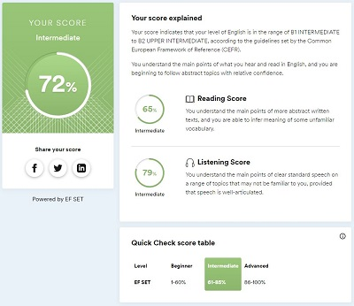

# Alexandra Pozdniakova
  
  [This is my GitHub](https://github.com/MouseBonnie)
  
### Contact information:
  * Email: *itlittlemouse@gmail.com*
  * Telegram: *@bonbon26*
  * Discord: *Bonbon#3261*
   
#### Briefly About Myself:
Actually, I just started to learn HTML, but  have grait potential to learn JS with RS-School at this course :) 
I find RS-School accidentally, and I don't have even profile at codewars yet.


#### Skills:
  * Basic HTML5, basic CSS
  * Photoshop
  * MS Excel

#### Code example:
```
function multiply(a, b){
  return a * b
}
```
#### Courses:
1. _**Dmitry Lavrik**_ "Basics of programming" on YouTube
1. "Introduction to Web Development" on _**HTMLAcademy**_
1. "Introduction to HTML and CSS" on _**HTMLAcademy**_

#### Languages:
  English:
  
  Russian - Native